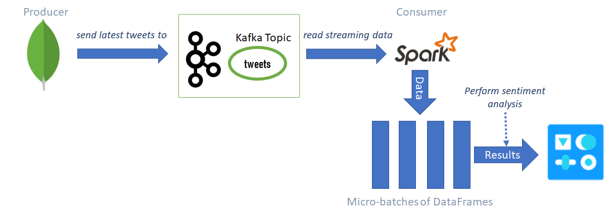
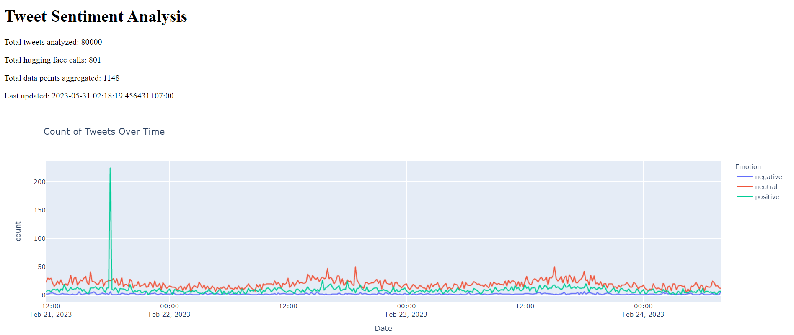

<div style="text-align: center">
    <span style="font-size: 3em; font-weight: 700; font-family: Consolas">
        Lab 04 <br>
        Streaming Data Processing with Spark
    </span>
    <br><br>
    <span style="">
        An assignment for <code>CSC14118</code> Introduction to Big Data @ 20_21
    </span>
</div>


<span style="font-size: 20px; color: red"> Collaborators (Mango-Tada) </span>
- `20120246` **Nguyễn Hoàng Anh** ([@Yoshiyuki194](https://github.com/Yoshiyuki194))
- `20120247` **Nguyễn Phương Anh** ([@PhuongAnh57](https://github.com/PhuongAnh57))
- `20120422` **Nguyễn Thị Ánh Tuyết** ([@Tuyet3005](https://github.com/Tuyet3005))
- `20120460` **Lê Nguyễn Hải Dương** ([@LeNguyenHaiDuong](https://github.com/LeNguyenHaiDuong))
 
<span style="font-size: 20px; color: red"> Instructors </span>
- `HCMUS` **Đoàn Đình Toàn** ([@ddtoan](ddtoan18@clc.fitus.edu.vn))
- `HCMUS` **Nguyễn Ngọc Thảo** ([@nnthao](nnthao@fit.hcmus.edu.vn))
---
<div style="page-break-after: always"></div>

<span style="font-size: 20px; color: red"> Content </span>
- [1. Assess the level of project completion](#1-assess-the-level-of-project-completion)
- [2. The answer to each section’s tasks](#2-the-answer-to-each-sections-tasks)
  - [2.1. Get Twitter tweets from Hugging Face](#21-get-twitter-tweets-from-hugging-face)
    - [2.1.1. Download dataset from Hugging Face](#211-download-dataset-from-hugging-face)
    - [2.1.2. Store downloaded data into MongoDB](#212-store-downloaded-data-into-mongodb)
    - [2.1.3. Combine the code into a function that supports streaming](#213-combine-the-code-into-a-function-that-supports-streaming)
  - [2.2. Stream tweets to Apache Spark](#22-stream-tweets-to-apache-spark)
    - [  2.2.1. Install Apache Kafka and Spark](#-221-install-apache-kafka-and-spark)
    - [  2.2.2. Set up Apache Kafka's producer](#-222-set-up-apache-kafkas-producer)
    - [  2.2.3. Set up Apache Spark as Kafka's consumer](#-223-set-up-apache-spark-as-kafkas-consumer)
  - [2.3. Perform sentiment analysis on tweets](#23-perform-sentiment-analysis-on-tweets)
    - [2.3.1. Function to classify sentiment for the tweet](#231-function-to-classify-sentiment-for-the-tweet)
    - [2.3.2. Function to process stream data](#232-function-to-process-stream-data)
      - [2.3.2.1. Function save\_to\_df](#2321-function-save_to_df)
      - [2.3.2.2. Function start\_stream](#2322-function-start_stream)
    - [2.3.3. Summarize:](#233-summarize)
  - [2.4. Visualize the analytic results using Dash and Plotly](#24-visualize-the-analytic-results-using-dash-and-plotly)
  - [2.4.1. Define the visualization interface](#241-define-the-visualization-interface)
  - [2.4.2. Define the callback function](#242-define-the-callback-function)
  - [2.4.3. Run the app](#243-run-the-app)
  - [2.4.4. Insights](#244-insights)
- [3. Reflection](#3-reflection)
- [4. References](#4-references)

---
<div style="page-break-after: always"></div>
</br>

## 1. Assess the level of project completion
|  STT  | Task                                 | Percent |   Member   |
| :---: | :----------------------------------- | :-----: | :--------: |
|   1   | Get Twitter tweets                   |  100%   | Ánh Tuyết  |
|   2   | Stream tweets to Apache Spark        |  100%   | Hoàng Anh  |
|   3   | Perform sentiment analysis on tweets |  100%   | Hải Dương  |
|   4   | Visualize the analytic results       |  100%   | Ánh Tuyết + Phương Anh |
|   5   | Write a report                       |  100%   | All members |
</br>

## 2. The answer to each section’s tasks
### 2.1. Get Twitter tweets from Hugging Face
To download the dataset from `Hugging Face`, we need to use `requests` to get the dataset from their API, then use `pymongo` to store the downloaded data into `MongoDB` database.

In order to do so, we must first install the libraries using `pip`, and also install `MongoDB` into `Google Colab` environment.

```
    !pip install requests pymongo
    !apt install mongodb
    !service mongodb start
```

#### 2.1.1. Download dataset from Hugging Face

- When we access the dataset with the link `https://huggingface.co/datasets/deberain/ChatGPT-Tweets`, we can see "API" button, that tells us the `curl` command to get the dataset using its API like so:

    ```
    curl -X GET \
        "https://datasets-server.huggingface.co/rows?dataset=deberain%2FChatGPT-Tweets&config=deberain--ChatGPT-Tweets&split=train&offset=0&limit=100"
    ```

- From this, we can see the API link is in the format `https://datasets-server.huggingface.co/rows?dataset=deberain%2FChatGPT-Tweets&config=deberain--ChatGPT-Tweets&split=train&offset=0&limit=100`, having 2 parameters that is interesting:

    - `offset`: the start of the data batch to download, 0-indexed.
    - `limit`: number of data rows the API returns, default is 100.

- So in order to get all available data, we need to get them in batch by using the `offset` and `limit` to get the batch's rows, and `requests.get(link).json()` to download them

#### 2.1.2. Store downloaded data into MongoDB

- After requesting to the API link, we will have the `json` data as follow:

    ```javascript
    {
        features: [...],
        rows: [
            {
                row_idx: 0,
                row: {
                    Date: "2023-02-24 07:59:26+00:00",
                    Tweet: "How to hire 100x more productive team members for Free? We just interviewed and hired #chatgpt for free as a team member. https://t.co/JwlXXK6WKt",
                    Url: "https://twitter.com/smnishad/status/1629028212914245632",
                    [...]
                },
                truncated_cells: []
            },
            [...]
        ]
    }
    ```

- We can see that to get the actual data from API-returned `json`, we need to get them from `data['rows']['row']`, then store them into the `MongoDB` database. Keep doing this until the API returns 0 result, we will have all rows in the dataset.

- Then to store those data into `MongoDB`, we can use the following syntax, which will try to insert only if their is no row with the same `id` existed in the database:

    ```python
    db.tweets.update_one(
        {"id": row['id']},
        {"$set": row},
        upsert=True
    )
    ```

#### 2.1.3. Combine the code into a function that supports streaming

- In order to be able to use this as a streaming function, we have to combine the code into a function with 2 inputs: `limit` and `offset`. Then we can get the data from `Hugging Face` in batch simply by changing the inputs.

    ```python
    def download_tweets(limit, offset=None):
        # Download from API
        [...]

        # Save the data into MongoDB
        [...]

        if <there_is_more>:
            return True
        else:
            return False
    ```
### 2.2. Stream tweets to Apache Spark

Our team chose Apache Kafka as the tool for data streaming in order to complete this task. The pipeline of the producer and consumer is illustrated in the figure below.

<div style="text-align: center">

*Structured Streaming and Kafka Integration Pipeline*

</div>

#### &emsp; 2.2.1. Install Apache Kafka and Spark
- **Kafka installation**
1. First, we need to install the required kafka-python packages by running the following command:

    ```python
    !pip install kafka-python
    ```
2. Next, we need to download and setup Kafka and Zookeeper instances. For demo purposes, we can set up the following instances locally:
    - Kafka (Brokers: 127.0.0.1:9092)
    - Zookeeper (Node: 127.0.0.1:2181)

    To do this, run the following commands:
    ```python
    # Download the Kafka 3.4.0 - Scala 2.12 packages
    !curl -sSOL https://downloads.apache.org/kafka/3.4.0/kafka_2.12-3.4.0.tgz
    # Unzip the packages downloaded
    !tar -xzf kafka_2.12-3.4.0.tgz
    ``` 

3. Once all required packages downloaded, we can start the Zookeeper and Kafka services to use. We can use the default configurations provided by Apache Kafka for spinning up the instances by running the following commands:
    ```python
    # Start the Zookeeper server
    ./kafka_2.13-2.7.2/bin/zookeeper-server-start.sh -daemon ./kafka_2.13-2.7.2/config/zookeeper.properties
    # Start the Kafka server
    ./kafka_2.13-2.7.2/bin/kafka-server-start.sh -daemon ./kafka_2.13-2.7.2/config/server.properties
    ```

4. Once the instances are started as daemon processes, we can check if they are running by using this command:
    ```
    ps -ef | grep kafka
    ```

- **Spark installation**

    First, install OpenJDK 8, download Apache Spark 3.4.0 with Hadoop 3, extract the downloaded archive, and install the findspark package.

    ```python
    !apt-get install openjdk-8-jdk-headless -qq > /dev/null
    !wget -q "https://archive.apache.org/dist/spark/spark-3.4.0/spark-3.4.0-bin-hadoop3.tgz"
    !tar xf spark-3.4.0-bin-hadoop3.tgz
    !pip install -q findspark
    ```
    Next, set the JAVA_HOME and SPARK_HOME environment variables to the respective paths of the installed OpenJDK 8 and Apache Spark 3.1.1. It then imports the findspark package and initializes it using the findspark.init() method. The findspark.find() method returns the path to the Spark installation.
    
    ```python
    import os
    os.environ["JAVA_HOME"] = "/usr/lib/jvm/java-8-openjdk-amd64"
    os.environ["SPARK_HOME"] = "spark-3.1.1-bin-hadoop2.7"
    import findspark
    findspark.init()
    findspark.find()
    ```

    After running this code, we should be able to import and use PySpark in our Google Colab notebook.

#### &emsp; 2.2.2. Set up Apache Kafka's producer

1. First, we need to create a topic to subscribe by running this command:
    ```python
    !./kafka_2.12-3.4.0/bin/kafka-topics.sh --create \
    --bootstrap-server 127.0.0.1:9092 \
    --replication-factor 1 \
    --partitions 1 \
    --topic tweets
    ```
2. Set up Kafka Producer 
- Next, we define the Producer class as a subclass of the KafkaProducer class in the kafka-python library. It is used to send messages to a Kafka topic. The class takes a dataframe and a Kafka topic as input and sends each row of the dataframe as a message to the Kafka topic.
- The json message schema is as follows (*row* refers to a row in the dataframe provided):
    ```python
    msg = {
        'id': row['id'],
        'Date': row['Date'],
        'Likes': row['Likes'],
        'Location': row['Location'],
        'Retweets': row['Retweets'],
        'Tweet': row['Tweet'],
        'Url': row['Url'],
        'User': row['User'],
        'UserCreated': row['UserCreated'],
        'UserDescription': row['UserDescription'],
        'UserFollowers': row['UserFollowers'],
        'UserFriends': row['UserFriends'],
        'UserVerified': row['UserVerified']
    }
    ```
- Finally, the pipeline from ingesting the latest data from MongoDB to pushing them to a Kafka topic is demonstrated in the code snippet below:
    ```python
    def stream_to_kafka(n):
        global client
        db = client.data
        collection = db.tweets
        df = pd.DataFrame(list(collection.find().sort('_id', -1).limit(n)))
        df.drop(columns=['_id'], axis=1, inplace=True)

        # create a Producer instance
        producer = Producer(
            bootstrap_servers=['localhost:9092'],
            value_serializer=lambda m: json.dumps(m).encode('utf-8'),
            api_version=(0, 10, 1)
        )

        # define the name of the Kafka topic to send the messages to
        kafka_topic = 'tweets'

        # send the dataframe to the Kafka topic
        producer.produce(df, kafka_topic)
    ```

#### &emsp; 2.2.3. Set up Apache Spark as Kafka's consumer 

1. The first step is creating a SparkSession instance.
    ```python
    my_spark = (SparkSession
                .builder
                .config("spark.executor.memory", "1g") \
                .config("spark.jars", "spark-sql-kafka-0-10_2.12-3.4.0.jar") \
                .config("spark.jars", "kafka-clients-0.11.0.0.jar") \
                .appName("csc14112") \
                .getOrCreate())
    ```
2. Subsequently, we can read data from Kafka by creating a Kafka source for Streaming Queries according to *Structured Streaming + Kafka Integration Guide* from Spark 3.4.0 Documentation.
    ```python
    # define the Kafka bootstrap servers and topic to read from
    kafka_bootstrap_servers = "localhost:9092"
    kafka_topic_name = "tweets"

    # read data from the Kafka topic
    df = (my_spark.readStream
        .format("kafka")
        .option("kafka.bootstrap.servers", kafka_bootstrap_servers)
        .option("startingOffsets", "earliest")
        .option("failOnDataLoss", "false")
        .option("subscribe", kafka_topic_name)
        .load())
    ```

### 2.3. Perform sentiment analysis on tweets

#### 2.3.1. Function to classify sentiment for the tweet

- Our group has chosen a pre-existing function from the nltk library called SentimentIntensityAnalyzer to classify tweets in this lab. The function will return a dictionary that include 4 values: negative, positive, neutral and compound. The first three values have a range from 0 to 1, indicating the intensity of the sentiment. A value of 0 represents a weak emotional sentiment, while a value closer to 1 indicates a stronger sentiment. The compound have a range from -1 to 1. The compound value is a synthesized score derived from the three aforementioned values and has a range from -1 to 1. A value closer to -1 indicates a negative sentiment, while a value closer to 1 indicates a positive sentiment.

- In the end, we decided to classify sentiments as negative for values <= -0.5, positive for values > 0.5, and anything in between as neutral. Therefore, I have implemented a function called **analyze_sentiment** that takes a tweet as input and returns its classification. Then, I use a UDF on this function to create another function called **analyze_sentiment_udf** that can be applied to a column of data.

    ```python
    # A function return the categorical of one tweet
    def analyze_sentiment(tweet):
        # Init SentimentIntensityAnalyzer
        analyzer = SentimentIntensityAnalyzer()
        sentiment = analyzer.polarity_scores(tweet)
        if sentiment['compound'] < -0.5:
            return 'negative'
        elif sentiment['compound'] > 0.5:
            return 'positive'
        else:
            return 'neutral'

    # Use udf on the function for one tweet to have another function that can apply on the whole column
    analyze_sentiment_udf = udf(analyze_sentiment, StringType())
    ```

#### 2.3.2. Function to process stream data

For the stream data, we use writeStream.foreachBatch(**func**) to process it. The **func** is a function that is implemented by our group itself to process data from each batch. With writeStream, **func** will be called automatically whenever the data is comming so we don't need to call func at regular intervals even when we don't have new data. The **function** that being called by **writeStream.foreachBatch** will receive 2 parameter that is the table of new data and an id.

__foreachBatch__ is similar to a process that only starts the next process when it finishes. Multiple different processes can run in parallel at the same time, but they are not of the same type.

In this requirement, we use will implement two functions that is **save_to_df** and **start_stream** to process data.

##### 2.3.2.1. Function save_to_df

This function is for saving the **batch_df** - new data into the pandas DataFrame.

First of all we will take the column named **value** from the data taken from Kafka and defind the type as StringType. 

```python
query = df.withColumn("value", col("value").cast(StringType()))
```

Now all of the value are StringType with structure of a json so we need to defind a schema for it with the columns's name that we need to use. 

```python
json_schema = (StructType()
            .add("id", StringType())
            .add("Date", StringType())
            .add("Tweet", StringType()))
```

Save the new data from **batch_df** to **parse_df** by the **json_schema** below. So now the **parse_df** will have the number of columns equal to the columns that is defind in **json_schema**.

```python
parsed_df = (batch_df
                .select(from_json(col("value"), json_schema).alias("data"))
                .select("data.*"))
```

After parse the data, I will take the column **Date** and create a new column named **Emotion** is the result of the **analyze_sentiment_udf** on the **Tweet** column.
   
```python
result = parsed_df.select(col("Date"), analyze_sentiment_udf(col("Tweet")).alias("Emotion"))
```

I use 2 global parameters to store the result: **resultDF** is the totalization of all the **result**. In the beginning this is None and after the first time this become a DataFrame. For all the next time it just need to add the **result** into the end of DataFrame.

```python
if resultDF is None:
    resultDF = result
else:
    resultDF = resultDF.unionByName(result)
```

and **resultPandasDF** is a pandas DataFrame that calculates the count of emotions for each time frame with a frequency of 10 minutes.

```python
res = resultDF.toPandas().groupby(["Date", "Emotion"]).count().reset_index()
    if 'count' not in res.columns:
        res['count'] = 1
    res.Date = pd.to_datetime(res.Date)
    resultPandasDF = (res
                    .groupby(['Emotion', pd.Grouper(key='Date', freq='10min')])
                    .sum()
                    .reset_index())
```

##### 2.3.2.2. Function start_stream

This is the function to download message from **hugging_face** and store to **mongodb** and send message to kafka. Each time we call **stream_to_kafka** function, the readStream from Spark will be activated and receive the new message. Then the **writeStream.foreachBatch** will be call and the process of **start_stream** will be call again. The iteration will be continue until we **stop()** the process.

```python
def start_stream(batch_df, epoch_id):
    download_tweets(100)
    stream_to_kafka(100)
```

#### 2.3.3. Summarize:

After finished all the tast we call **start()** for these two process and the Stream will start.

```python
process_query = query.writeStream.foreachBatch(save_to_df)
process_stream = process_query.start()
read_query = query.writeStream.foreachBatch(start_stream)
read_stream = read_query.start()
```

### 2.4. Visualize the analytic results using Dash and Plotly

To visualize the data with an interactive user interface, we need to use `dash` and `plotly`. However, when the code is ran on `Google Colab` or a `Jupyter Notebook`, we need to install `jupyter-dash` library in addition, and the libraries need to satisfy following versions in order to work properly:

```
  !pip install dash==1.19.0 werkzeug==2.0.0 jupyter_dash==0.3.0
```
### 2.4.1. Define the visualization interface

- To visualize using `dash`, we need to define the following structure:

    ```python
    app.layout = html.Div(children=[
        html.H1(children='Tweet Sentiment Analysis'),
        html.Div(id='stat'),
        dcc.Graph(id='line-plot'),
        dcc.Interval(id='interval', interval=1000, n_intervals=0)
    ])
    ```

- In which: `html.H1` displays the chart title, `html.Div(id='stat')` shows the statistic related to the streaming and visulization process (rows downloaded, API calls made, etc.), `dcc.Graph` displays the chart, and `dcc.Interval` refreshes the chart in realtime.

### 2.4.2. Define the callback function

- Data downloading and analyzing will be done in another thread (using `foreachBatch` function from `pyspark`), so this callback function only cares about updating the chart using the newly analyzed data.

    ```python
    @app.callback(
        [dash.dependencies.Output('line-plot', 'figure'),
            dash.dependencies.Output('stat', 'children')],
        [dash.dependencies.Input('interval', 'n_intervals')]
    )
    def update_plots(n):
        global resultPandasDF
        # Do processing here
        [...]

        # Update the plot
        line_plot = px.line(...)
        line_plot.update_layout(transition_duration=500)
        
        return [
            line_plot,
            [
                html.P(f"Total tweets analyzed: {...}"),
                html.P(f"Total hugging face calls: {...}"),
                html.P(f"Total data points aggregated: {...}"),
                html.P(f"Last updated: {...}")
            ]
        ]
    ```

- We use `dash.dependencies.Output` to declare that this callback will update `stat` and `line-plot`, and use `dash.dependencies.Input` to declare that the callback will be called every interval. This will then re-draw the line plot, and return the figure along with statistics information to update `stat`.

### 2.4.3. Run the app

- We will run 3 processes in parallel: downloading the dataset from `Hugging Face` and storing them into `MongoDB`, analyzing the data with `spark`, visualizing the data to `dash` interface.

    ```python
    # Run the app
    print("Start streaming...")
    process_query = query.writeStream.foreachBatch(process_batch)
    process_stream = process_query.start()
    read_query = query.writeStream.foreachBatch(start_stream)
    read_stream = read_query.start()
    app.run_server(host='0.0.0.0', mode='inline', debug=True)
    ```
### 2.4.4. Insights

<div style="text-align: center">
*Chart to analyze user emotions on Twitter in real time*
</div>

- There are three types of emotions when users use Twitter: negative, positive, neutral.
- The above chart is a representation of the user's emotions from 12PM on February 21st to 0AM on February 24th:
  - In general, users with neutral emotions in Twitter more than the other two types of emotions. The number of neutral tweets ranges from 20-25, with 3 times peaking at 50 on the afternoon of February 22 and the afternoon of February 23.
  - Positive emotions are in second place in the number of tweets released, with around 5 to 15 tweets in the specified time period. However, there is one notable exception, that is the number of tweets on February 21 exceeded the normal level by up to 200 tweets.
  - Negative emotions ranked last among the number of published tweets. During that time, between 0 and 5 tweets were sent with negative emotion.
=> In summary, based on Twitter data analysis, we found that users typically use the platform to post neutral or positive content rather than negative. However, on February 21st, there was a significant increase in positive statements, indicating that a notable event occurred that attracted the attention of many users. Additionally, we also observed very few negative statements on Twitter, suggesting that the social media platform is safe and healthy.

## 3. Reflection

This lab is a challenging and grinding one that requires the integration many tools to work as a whole.

During our journey to the deadline for this lab assignment, we encountered a few bugs. One of the challenges we faced was related to version compatibility, resulting in unexpected results. However, after reviewing the documentation and official guide, we was able to fix the issue. This process taught us the importance of carefully checking for compatibility when working with different tools and technologies.

Another difficulty we encountered is waiting too much when testing. If we have anything changed in our code, we need to remove all packages and rerun so it took too much time to reinstall the packages. After all, some members of our team decided to run the code on local host for a faster testing and some still used Google Colab because we don't want to install many things on our computer. 

The next challenge is saving error when we saved the batch of streaming data into our database. It took a long time for create a database and our team cannot add more data for the next batch. If we save the data into database, we need to call a function to read it and it's not optimal. At the end, we used a global variable to save the dataframe so we didn't need to implement too much function and not to waste time for writing and reading data.

Altogether, this lab assignment sparked our interest in stream processing due to its wide range of real-life applications and ongoing development. Overall, we learned a lot from this experience and are excited to continue exploring this field.

## 4. References

1. https://stackoverflow.com/questions/53581278/test-if-notebook-is-running-on-google-colab
2. https://gist.github.com/korakot/64f4e589eff252cf0486388da26c17fd
3. https://pymongo.readthedocs.io/en/stable/api/pymongo/collection.html
4. https://docs.mongodb.com/manual/reference/method/db.collection.updateOne/
5. https://requests.readthedocs.io/en/latest/user/quickstart/
6. https://dash.plotly.com/minimal-app
7. https://dash.plotly.com/live-updates
8. https://dash.plotly.com/workspaces/using-dash-in-jupyter-and-workspaces
9. https://spark.apache.org/docs/latest/structured-streaming-kafka-integration.html
10. https://colab.research.google.com/github/recohut/notebook/blob/master/_notebooks/2021-06-25-kafka-spark-streaming-colab.ipynb
11. https://pypi.org/project/kafka-python/